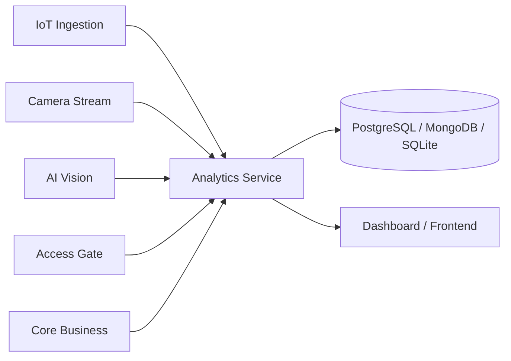

# Service Boundary — Nhóm 6 (A5 · Product A · Analytics)

## 1. Thông tin nhóm và đề tài

| Mục | Nội dung |
|-----|----------|
| Nhóm lớp | **Nhóm 6** |
| Mã đề tài (bảng phân chia) | **A5** |
| Sản phẩm | **Product A** — Smart Campus Operations Platform |
| Service phụ trách | **Analytics Service** |
| Tên đề tài | Xây dựng dịch vụ tổng hợp và phân tích dữ liệu |
| Lớp | CNTT 17-09 |

**Thành viên**

- Lê Phi Trường
- Võ Văn Quyền
- Nguyễn Xuân Ninh

---

## 2. Vai trò service trong nền tảng

Analytics Service thu thập (pull) hoặc nhận (push) dữ liệu từ các service nguồn, **tổng hợp metric**, **thống kê** và **trả báo cáo JSON** (có thể phục vụ dashboard). Service **không** thay thế Core Business (ra quyết định/cảnh báo) hay Notification (gửi thông báo).

---

## 3. Actor, Consumer và Provider

| Vai trò | Đối tượng | Ghi chú |
|---------|-----------|---------|
| Actor (người/hệ thống tương tác) | Admin/Operator, Giảng viên | Xem báo cáo, đánh giá minh chứng |
| Consumer (gọi API Analytics) | Dashboard/Frontend (nếu có), nhóm khác cần báo cáo tổng hợp | Gọi endpoint `/analytics/...`, `/health` |
| Provider (Analytics gọi để lấy dữ liệu) | IoT Ingestion, Camera Stream, AI Vision, Access Gate, Core Business | Theo hợp đồng API từng team; URL cấu hình qua biến môi trường |

---

## 4. Ranh giới hệ thống (System boundary)

**Thuộc phạm vi nhóm (in scope)**

- API REST của Analytics (OpenAPI, test Postman/Newman, Docker).
- Luồng lấy dữ liệu từ upstream (HTTP client theo contract), tổng hợp metric, trả JSON có schema rõ.
- Lưu trữ tối thiểu cho tổng hợp/cache hoặc snapshot báo cáo (PostgreSQL/MongoDB/SQLite tùy chọn nhóm).
- Minh chứng vận hành: log, báo cáo test, screenshot/video theo yêu cầu học phần.

**Ngoài phạm vi nhóm (out of scope)**

- Thu thập trực tiếp từ ESP32, camera IP, RFID (thuộc các service nguồn).
- Rule nghiệp vụ tạo cảnh báo cuối cùng (Core Business).
- Gửi Telegram/email/webhook (Notification).

---

## 5. Service boundary (trách nhiệm cụ thể)

**Service làm**

- Nhận request tổng hợp theo thời gian, khu vực hoặc loại metric.
- Gọi (hoặc nhận webhook/event nếu thống nhất với nhóm nguồn) các API upstream để lấy dữ liệu phục vụ thống kê.
- Tính metric gợi ý đề bài: lượt ra/vào theo giờ, nhiệt độ trung bình, số cảnh báo trong ngày, số lần phát hiện chuyển động, số event bất thường, v.v.
- Trả báo cáo JSON; cung cấp `GET /health` (hoặc tương đương) cho giám sát.

**Service không làm**

- Không quyết định “có cảnh báo hay không” thay cho Core Business.
- Không gửi thông báo đa kênh.
- Không chạy mô hình AI nhận diện ảnh (AI Vision / Camera Stream).
- Không hard-code URL nhóm khác; dùng `.env` / `.env.example`.

---

## 6. Input / Output

### Input (nguồn dữ liệu tổng hợp)

- Dữ liệu cảm biến (nhiệt độ, độ ẩm, chuyển động, …) từ **IoT Ingestion**.
- Sự kiện camera / kết quả phát hiện từ **Camera Stream** / **AI Vision**.
- Sự kiện ra/vào từ **Access Gate**.
- Cảnh báo / quyết định nghiệp vụ từ **Core Business** (để đếm cảnh báo, event bất thường).

### Output (ví dụ báo cáo tổng hợp)

```json
{
  "date": "2026-05-02",
  "total_access": 120,
  "total_alerts": 5,
  "avg_temperature": 30.8,
  "motion_detections": 45,
  "abnormal_events": 3
}
```

---

## 7. API dự kiến (Buổi 1 — draft)

| Method | Endpoint | Mục đích |
|--------|----------|----------|
| GET | `/health` | Kiểm tra service sống |
| GET | `/analytics/summary` | Báo cáo tổng hợp theo ngày/khoảng thời gian |
| GET | `/analytics/access` | Thống kê lượt ra/vào theo giờ |
| GET | `/analytics/temperature` | Nhiệt độ trung bình theo phòng/khu vực |
| GET | `/analytics/alerts` | Số cảnh báo trong kỳ |
| GET | `/analytics/motion` | Số lần phát hiện chuyển động |

Phiên bản cuối sẽ được chốt ở Buổi 2 trong `openapi.yaml` và `endpoint_catalog.md`.

---

## 8. Bảng “ai gọi ai”

| Caller (Consumer) | Callee (Provider) | Mục đích |
|-------------------|-------------------|----------|
| Analytics Service | IoT Ingestion | Lấy dữ liệu cảm biến phục vụ metric |
| Analytics Service | Camera Stream / AI Vision | Lấy dữ liệu phát hiện / sự kiện hình ảnh |
| Analytics Service | Access Gate | Lấy dữ liệu lượt ra/vào |
| Analytics Service | Core Business | Lấy dữ liệu cảnh báo / quyết định |
| Dashboard / Frontend | Analytics Service | Hiển thị báo cáo, biểu đồ |
| (Tùy thống nhất lớp) Service khác | Analytics Service | Đọc báo cáo tổng hợp |

**Lưu ý tích hợp:** Analytics là **consumer** chính của nhiều upstream; đồng thời là **provider** cho UI hoặc service cần báo cáo. Không làm service cô lập: phải có ít nhất một kết nối thực tế với service khác theo tiến độ môn học.

---

## 9. Sơ đồ Service Boundary



---

